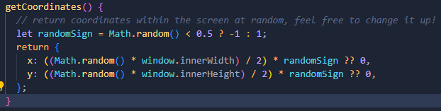

# Bonus JS features

`Inspiration:` https://javascript.plainenglish.io/5-cool-javascript-features-you-might-not-know-about-yet-f2fc818bdd31

## Nullish Operator

`One interesting feature introduced in recent versions of JavaScript (like ECMAScript 2020) is the Nullish Coalescing Operator (??). This operator provides a convenient way to handle default values in a more concise manner.`

## Defer

`When the JavaScript code size increases, it may lead to the browser having to wait until all scripts are executed before loading the DOM and it increases the wait time.`

`By using this attribute we can tell the browser not to wait for the script; instead, it will continue building the DOM and in the background, the script will load.`

